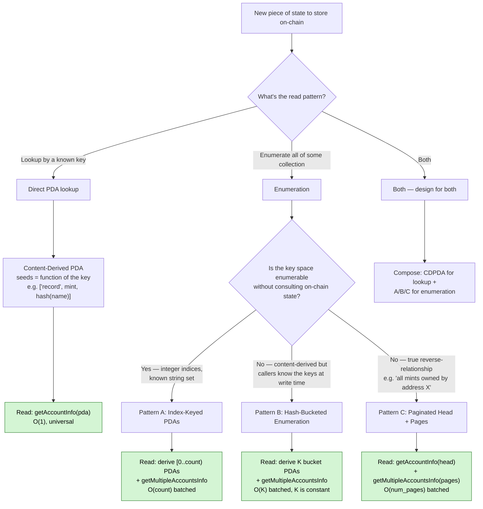
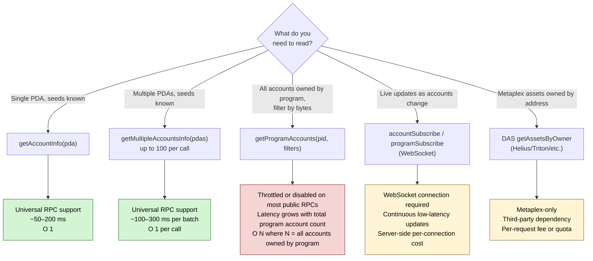
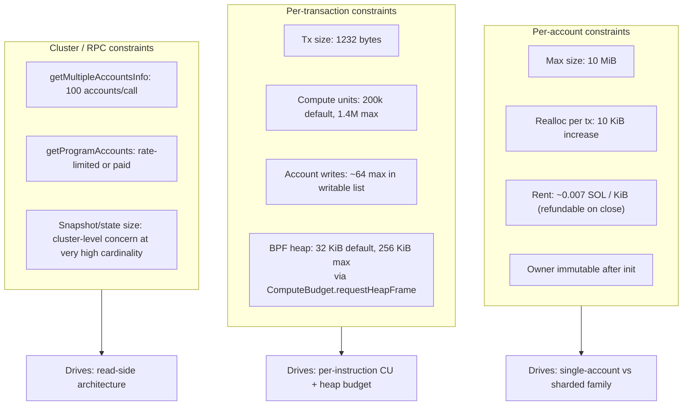
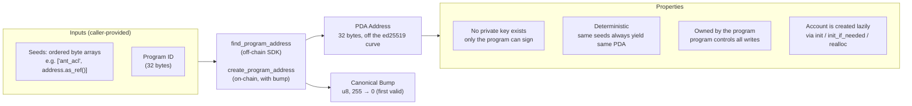
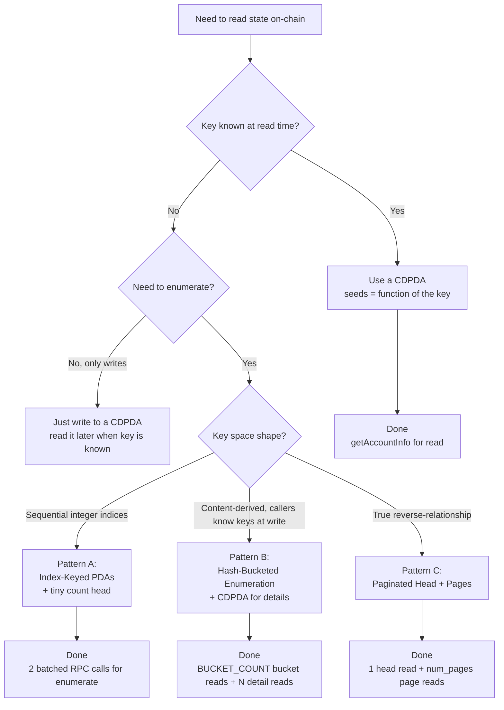

# Account Scaling Patterns

Reference doc for choosing how to lay out and address program-owned accounts on
Solana. Frames every "where do I put this state?" question through one lens:
**access pattern determines storage shape, and storage shape determines which
RPC calls a frontend can rely on.**

This is the canonical reference cited by scaling ADRs (e.g.
[ADR-012](./DECISIONS.md#adr-012-paginated-per-user-ant-acl)). It does
**not** prescribe specific actions for our existing surfaces — those
decisions live in the plans and ADRs that reference this doc.

> **Central rule:** stay above the `getProgramAccounts` line. Anything a
> frontend hot path needs to read should be addressable through
> `getAccountInfo` or `getMultipleAccountsInfo` — both of which are universal,
> unthrottled, and O(1)-per-call. `getProgramAccounts` is an indexer/admin
> tool, not a frontend primitive.

---

## 1. The decision in one picture



Three patterns (A, B, C), one shared lookup mechanism (CDPDAs), and an
escape-hatch (gPA) that doesn't appear on this diagram because it shouldn't be
on the frontend read path.

---

## 2. Why this matters: the query API surface

Solana exposes four ways to read program state. Their cost profiles diverge
dramatically and that divergence is what drives every scaling decision in
this doc.



| API | Scales with | Throttling | Universal? |
|---|---|---|---|
| `getAccountInfo` | O(1) regardless of program account count | None | Yes |
| `getMultipleAccountsInfo` | O(1) per batch of 100 | None | Yes |
| `getProgramAccounts` | O(N) where N = total program account count | **Heavy** | **No** — most production RPCs gate it |
| `accountSubscribe` / `programSubscribe` | Push-based | Connection limits | Yes (WebSocket) |
| DAS `getAssetsByOwner` | Per-request | Per-tier quotas | No — paid third-party |

The first two work the same on free-tier `api.mainnet-beta.solana.com` as
they do on a paid Helius tier. **The third does not.** That asymmetry is the
load-bearing fact for everything that follows.

### When `getProgramAccounts` *is* the right tool

It's fine for these uses, where it's run on infrastructure you control and
the cost is amortized across many user requests:

- **Indexer ingestion.** Run once on startup → switch to `programSubscribe`
  for incremental updates.
- **Off-chain admin or audit tooling.** Cron job from a paid RPC tier.
- **Migration scripts.** One-shot enumerate-and-rewrite.
- **Block explorers and one-off debugging.**
- **Local development.** Local validators have no throttling.

Rule of thumb: gPA is fine when it's run on infrastructure you control and
the latency/cost is amortized. It's a footgun when it's run on every
page-load with the user's RPC config.

---

## 3. Constraints that drive design



The interaction between these is what makes "build the right shape"
non-trivial:

- **10 MiB account cap** — you can't put everything in one account at high
  cardinality.
- **256 KiB max heap** — the binding constraint on most "single big account"
  designs is heap during deserialization, not account size.
- **200k–1.4M CU** — O(N) scans inside an instruction stop scaling somewhere
  between 5k and 50k entries depending on per-entry byte size.
- **No per-program PDA limit** — a program can own arbitrarily many PDA
  accounts. SPL Token has hundreds of millions; the property is fine.
- **gPA throttling** — you can never assume "RPCs will scan our program
  data" as a first-class read path.

For raw numbers and per-program account size accounting, see
[`COMPUTE_AND_LIMITS.md`](./COMPUTE_AND_LIMITS.md).

---

## 4. PDA fundamentals



Two implications matter for storage design:

1. **Anyone who knows the seeds can derive the address client-side.** That's
   the basis for content-derived PDAs — encode the lookup key into the seeds
   and the SDK never has to consult on-chain state to find the account.
2. **The program controls all writes.** That's why "give the contract a tiny
   metadata account to track counts" works without trust assumptions —
   the head can only change through ix handlers we control.

### Seed conventions used in this repo

| Convention | Example | Used for |
|---|---|---|
| `[<account_kind>, <key>]` | `["balance", user]` | Single-PDA lookup keyed on a single field |
| `[<account_kind>, <parent>, <child>]` | `["ant_record", mint, hash(undername)]` | Hierarchical lookup; child is hashed if variable-length |
| `[<account_kind>, <parent>, <idx_le>]` | `["ant_acl_page", address, page_idx.to_le_bytes()]` | Paginated families (Pattern A or C) |
| `[<account_kind>, <parent>, <hash_prefix>]` | `["records_bucket", mint, hash(undername)[0..2]]` | Hash-bucketed enumeration (Pattern B) |
| `[<account_kind>, "head"]` or `[<account_kind>, <parent>, "head"]` | `["ant_acl_head", address]` | Count/metadata head for a paginated family |

Variable-length name components are always hashed
(`hash(name.to_lowercase())`) so the seed slot has a fixed 32-byte length.

---

## 5. Content-Derived PDAs (CDPDA)

The foundational pattern. Use whenever lookup is "give me X by its known
key."

**Shape:**

```rust
// Storage
pub struct Record {
    pub data: ...,
    pub bump: u8,
}

// Seeds derive deterministically from the lookup key
let (pda, bump) = Pubkey::find_program_address(
    &[b"record", parent.as_ref(), &hash_of_key],
    program_id,
);
```

**Read flow:**

```ts
const pda = await deriveRecordPda(parent, key);
const account = await rpc.getAccountInfo(pda);  // O(1), universal
```

**Properties:**

- O(1) lookup, single RPC call, works on any tier.
- No on-chain index to maintain — the address *is* the index.
- Existence/non-existence is a single byte response from the RPC.
- Writes are independent — no shared "list" account contention.

**When to use:** any time the caller knows the key at read time. Almost
every individual-record lookup in the codebase falls here.

**When this isn't enough:** when callers need to enumerate records they
*don't* know the keys for. Then layer one of the patterns below.

---

## 6. Pattern A: Index-Keyed PDAs

For collections whose keys are **sequential integer indices** the caller can
enumerate trivially.

**Shape:**

```rust
// One head account tracks the upper bound.
pub struct CollectionHead {
    pub count: u32,
    pub bump: u8,
}

// One PDA per slot, addressed by integer index.
pub struct Slot {
    pub idx: u32,
    pub data: ...,
    pub bump: u8,
}

// Seeds:
//   ["collection_head"]                          → CollectionHead
//   ["collection_slot", idx.to_le_bytes()]       → Slot
```

**Read flows:**

```ts
// Lookup by index (e.g. random sampling for observer prescription):
const idx = secureRandom() % head.count;
const slot = await rpc.getAccountInfo(deriveSlotPda(idx));

// Enumerate all slots:
const head = await rpc.getAccountInfo(deriveHeadPda());
const slotPdas = Array.from({ length: head.count }, (_, i) => deriveSlotPda(i));
const slots = await rpc.getMultipleAccountsInfo(slotPdas);  // ~head.count/100 batches
```

**Properties:**

- Lookup by index: O(1).
- Enumeration: O(count) batched RPC calls, ~count/100 round trips.
- No upfront rent for empty slots — pay only as the collection grows.
- `count` is the only piece of "index"-shaped state, ~12 bytes.

**Compared to: pre-allocated zero-copy array (current `GatewayRegistry` /
`NameRegistry` shape)**

| | Index-keyed PDAs | Pre-allocated zero-copy array |
|---|---|---|
| Lookup by idx | One small account read | One large zero-copy load |
| Enumeration | Batched GMAI | Single large account load |
| Upfront rent | Pay per filled slot | Pay for max capacity at init |
| Size cap | None at protocol level | Bounded by 10 MiB account cap |
| Random sampling | Two account reads (head + slot) | One account read (registry) |
| Test ergonomics | Standard `init` | Pre-allocated via `add_account` hack to bypass `MAX_PERMITTED_DATA_INCREASE` |

**When to use:**
- Sequential integer indices (slot tables, leaderboards, prescription draws)
- The "zero-copy giant array" instinct — index-keyed PDAs are usually
  cleaner unless you need cross-slot atomicity in a single ix

**Worked example in this codebase:** `Gateway` (lookup by operator) is a
CDPDA. `GatewayRegistry` (enumeration via slot index) is currently a
pre-allocated zero-copy array — a candidate for migration to index-keyed
PDAs.

---

## 7. Pattern B: Hash-Bucketed Enumeration

For collections whose keys are **content-derived but not enumerable** —
the caller can derive a key's PDA at write time, but cannot list all keys
that exist.

The detail records still live at CDPDA addresses. Enumeration is layered
on top via fixed-size buckets keyed by a prefix of the key's hash.

**Shape:**

```rust
// Detail record — unchanged CDPDA storage.
pub struct Record {
    pub data: ...,
    pub bump: u8,
}
// Seeds: ["record", parent, hash(key)]

// Enumeration index — fixed number of buckets, deterministically addressed.
pub struct RecordBucket {
    pub key_hashes: Vec<[u8; 32]>,  // hashes of keys that map into this bucket
    pub bump: u8,
}
// Seeds: ["records_bucket", parent, hash(key)[0..PREFIX_BYTES]]
```

**Bucket count tradeoff:**

| Prefix bytes | Bucket count | Avg entries per bucket at 10k records | Empty-bucket reads on enumerate |
|---|---|---|---|
| 1 (8 bits) | 256 | ~40 | up to 256 |
| 2 (16 bits) | 65,536 | ~1 | up to 65,536 |
| 0 (single bucket) | 1 | 10,000 | 0 (but bucket itself becomes huge) |

For most surfaces, **1 byte / 256 buckets is the sweet spot**: enumeration
fan-out is bounded at 256 (≤3 batched GMAI calls), and per-bucket size
stays small enough to avoid heap pressure even at high record counts.

**Read flows:**

```ts
// Lookup by key — unchanged from a plain CDPDA:
const recordPda = deriveRecordPda(parent, key);
const record = await rpc.getAccountInfo(recordPda);  // O(1)

// Enumerate all records for this parent:
const bucketPdas = Array.from(
  { length: 256 },
  (_, prefix) => deriveBucketPda(parent, prefix),
);
const buckets = await rpc.getMultipleAccountsInfo(bucketPdas);  // ~3 batches
const allKeyHashes = buckets.flatMap(b => b?.key_hashes ?? []);
const detailPdas = allKeyHashes.map(h => deriveRecordPdaFromHash(parent, h));
const records = await rpc.getMultipleAccountsInfo(detailPdas);  // ~N/100 batches
```

**Write flows:**

```rust
// set_record:
//   1. Resolve target bucket from hash(key)[0..PREFIX_BYTES]
//   2. Init / update the Record CDPDA
//   3. Append hash(key) to the bucket if it's not already there
```

**Properties:**

- Lookup: O(1), unchanged from plain CDPDA.
- Enumeration: O(BUCKET_COUNT) bucket reads + O(N) detail reads, both
  batched.
- Write cost: one detail PDA write + one bucket PDA append.
- Bucket-empty rent overhead: ~$0.0035 per allocated bucket. At 256
  buckets that's ~$0.90 per parent if every bucket has at least one entry.
  Empty buckets stay unallocated.
- No head account / no count race — bucket location is purely a function
  of the key's hash.
- Tombstoning per-bucket on remove is straightforward (small slice).

**Compared to: explicit paginated index (Pattern C applied to enumerable
keys)**

| | Hash-bucketed | Explicit paginated head + pages |
|---|---|---|
| Lookup | O(1), unchanged | O(1), unchanged |
| Enumeration | O(BUCKET_COUNT) buckets + O(N) details | O(num_pages) pages + O(N) details |
| Write | Detail + one bucket | Detail + one page (dependent on head) |
| Determinism | Bucket = hash[prefix], no head dependency | Page = function of head's count, requires head read first |
| Empty-bucket overhead | ~256 reads on enumerate, mostly empty for small N | None — pages allocated as needed |
| Adversarial concentration | Possible — attacker chooses keys that hash to one bucket | Not an issue (count-keyed pages) |

**When to use:**
- Content-derived keys you want to enumerate (records-by-undername,
  per-mint metadata, etc.)
- High write parallelism is important (no head contention)
- Adversarial bucket-skewing is not a concern, or `MAX_BUCKET_SIZE` is
  enforced

**When *not* to use:**
- Reverse-relationships where the parent isn't part of the key (use
  Pattern C)
- Enumeration is rare and gPA from infrastructure you control is fine
- Bucket-skewing is a real adversarial concern (e.g. attacker can pick
  many keys that land in the same bucket)

---

## 8. Pattern C: Paginated Head + Pages

For **true reverse-relationships** — where the lookup is "given X, what's
related to X?" but the relationship isn't encoded in any natural
content-derived seed for the related entries.

This is the pattern that *requires* index-shaped state because there's no
content-derivation that gets you to the answer.

**Shape:**

```rust
pub struct CollectionHead {
    pub key: Pubkey,           // the parent (e.g. user address)
    pub page_count: u64,       // u64 by convention — see §9 rule 8
    pub total_entries: u64,    // u64 by convention
    pub bump: u8,
}
// Seeds: ["collection_head", parent]

pub struct CollectionPage {
    pub key: Pubkey,
    pub page_idx: u64,                     // u64 — 8-byte LE seed encoding
    pub entries: Vec<Entry>,               // capped at MAX_PER_PAGE; entry shape per use case
    pub bump: u8,
}
// Seeds: ["collection_page", parent, page_idx.to_le_bytes()]   (always 8 bytes)
```

> **u64 by convention.** All count and index fields in scaling-related
> shapes use `u64` regardless of the cardinality the design *currently*
> needs to support. The rent and seed-encoding cost is negligible (~4 B
> per head, +6 B per page seed vs `u16`), and it eliminates a class of
> "we hit the cap, now we have to migrate the schema" problems for cheap.
> The 8-byte LE encoding for page index seeds is the only ergonomic
> consequence on the SDK side.

**Read flow:**

```ts
const head = await rpc.getAccountInfo(deriveHeadPda(parent));
const pagePdas = await Promise.all(
  Array.from({ length: Number(head.page_count) }, (_, i) =>
    derivePagePda(parent, BigInt(i)),
  ),
);
const pages = await rpc.getMultipleAccountsInfo(pagePdas);  // ~page_count/100 batches
const entries = pages.flatMap(p => p ? decodePage(p.data).entries : []);
```

**Write flows:**

```rust
// add_entry (SDK orchestration: pick first non-full page, else add_page):
//   1. Read head
//   2. Read pages until first non-full one is found (1 RPC if last is non-full)
//   3. If all full: prepend add_page() ix → page_count += 1; new page becomes target
//   4. Verify (asset, role) relationship against canonical state
//   5. Append entry to target_page.entries (realloc grows the account)
//   6. Bump head.total_entries

// remove_entry (SDK orchestration: scan pages off-chain to locate entry):
//   1. Read head
//   2. getMultipleAccountsInfo(pages) — locate (mint, role)
//   3. Pass containing page in the ix accounts
//   4. Verify the relationship is gone in canonical state
//   5. swap_remove the matching entry inside that page
//   6. Decrement head.total_entries
//   7. (Optional) close_page if this was the last page and it's now empty
```

**Per-page sizing:**

`MAX_PER_PAGE = 256` is the default working point. For a 33-byte entry
(`Pubkey + u8 role`):

- 256 × 33 bytes = 8.5 KiB raw page data
- Fits the default 32 KiB BPF heap with margin (no `requestHeapFrame`
  needed)
- Stays under Solana's 10 KiB per-tx realloc limit at full size
- Linear scan to find a (mint, role) entry: trivial CU at 256

**Remove strategy:**

| Strategy | Pros | Cons |
|---|---|---|
| **`swap_remove` within page (chosen default)** | Single-page write; pages stay densely packed within themselves; SDK's "append to first non-full page" rule keeps holes filled | Page can stay sparse until next append; rent on the page is only refunded when it empties *and* it's the last page |
| **Tombstone** | Even simpler write; tombstones can be skipped on read | Wasted slots until the page is fully empty + closed; entry-not-equal-to-tombstone invariant added everywhere |
| **Cross-page swap-with-last** | Pages always perfectly dense | Two `Account<...>` slots per remove; second-page realloc; more invariants to validate |

Default to **`swap_remove` within the supplied page**. The SDK's append
rule (always write to the first non-full page) consumes any holes
created by removes before adding new pages, so density is preserved at
realistic churn levels without cross-page complexity. Cross-page
compaction is a future optimization — easy to add later if a specific
surface needs it.

**Properties:**

- Read: 2 batched RPC roundtrips regardless of cardinality (head +
  ≤page_count/100 batches of pages).
- Write: O(1) — one head + one page per ix.
- No protocol-level cap — `page_count` grows as the relationship size
  grows.
- Cap-per-page is a heap optimization, not a policy ceiling.

**When to use:**
- Reverse-relationships ("ANTs owned by address X")
- Membership lists where the parent isn't part of the entry's natural key
- Anything where neither integer indices nor content-derivation gets you
  to the entries

**Unified relationship encoding (optional, recommended).** When the
collection is logically "all relationships of various kinds X has with
Y", encode the relationship as a `u8 role` byte alongside each entry
rather than maintaining parallel `Vec`s. This:

- Halves the schema size for the head (no `Vec<Pubkey>` to track per
  relationship type), simplifies maintenance ix counts, and lets new
  relationship kinds (e.g. `UndernameOwner`) be added by reserving a
  codepoint instead of a schema change.
- Costs 1 byte per entry — at 256 entries/page, that's 256 B per page,
  immaterial.

Reads filter by role client-side; writes target the same paginated
structure regardless of relationship type.

**Worked example:** the per-address ANT ACL — the parent (address)
doesn't appear in the entries (mints), so neither Pattern A nor B works.
Pagination + unified `role: u8` encoding lands the access pattern on
`getAccountInfo` + `getMultipleAccountsInfo` only. See
[ADR-012](./DECISIONS.md#adr-012-paginated-per-user-ant-acl) for the full
treatment.

---

## 8a. Reverse-lookup indexes — usually skip them

A common urge with Pattern C is to add a "reverse" PDA so you can answer
"given an entry, who has it in their collection?" without scanning the
collection from the entry side.

For the ANT ACL the question is: given a mint, who lists that mint in
their `AclPage`s? Adding an `AclReverse(mint, role)` PDA listing the
addresses whose ACL contains the (mint, role) pair would mean a
permissionless reconcile path could find a stale entry without scanning
the holder's pages.

The cost-benefit comparison:

| | With reverse index | Without (chosen for ACL) |
|---|---|---|
| Marginal rent (50k mints × 2 roles) | ~$370 globally for the reverse-PDAs themselves | $0 |
| Marginal write CU per `record` ix | +1 PDA init / append on every record + every remove | 0 |
| Reconcile RPC | 1 read | `page_count / 100` batches off-chain scan |
| Permissionless reconcile ix accounts hint | (mint, role) suffices | (mint, role, page_idx) — caller supplies hint after off-chain scan |
| New SDK surface | Reverse index + dedicated reconcile flow | None (cleanup uses the existing scan-then-call pattern) |

The reverse index is paying a global rent + per-write CU bill on every
write to optimize a path that runs only when the relationship goes
stale. For surfaces where staleness is the rare case (eager
SDK-bundling + UI-flagged staleness covering the common case) the
trade-off goes the other way — skip the reverse index and pay the
batched scan cost on the rare reconcile.

**Default policy:** start without a reverse index. Add one only if the
reconcile path becomes a measurable hot-path (e.g. an automated
sweeper-bot is doing thousands of reconciles a day) and the off-chain
scan cost outweighs the global rent + CU bill.

**Subtle UX gotcha with `swap_remove` + last-page-only close.** Per-entry
removal does *not* refund rent. The page's data length stays at the
high-watermark until the page empties *and* it's the last page *and*
`close_page` is called. This is fine for ACL-shaped surfaces (pages are
small, refund mechanism exists for users who close their entire
collection) but worth flagging in any UI that surfaces "rent reclaimed"
counters for individual removes.

---

## 9. Picking a pattern



### Rules of thumb

1. **Default to a CDPDA.** Most lookups in well-designed Solana programs
   are content-derived. If you find yourself maintaining an index for "the
   X belonging to Y" where Y is encodable in seeds, you're probably
   missing a CDPDA opportunity.

2. **A "tiny count head" is not really an index.** Pattern A's
   `CollectionHead` is ~12 bytes and tracks one number. That's not the
   kind of "index" we're trying to avoid — it's just the upper bound for
   enumeration. The patterns we're avoiding are the ones with `Vec<Pubkey>`
   in a single account that grows with cardinality.

3. **`MAX_PER_PAGE = 256` is the default working point.** For
   `Vec<Pubkey>`-shaped or `Pubkey + u8`-shaped entries it fits the
   default BPF heap with margin. Different entry types may justify
   different per-page caps, but 256 is the starting guess.

4. **`swap_remove` within the supplied page is the default removal
   strategy** for Pattern C. Combined with the SDK's
   "append-to-first-non-full-page" rule it preserves density at
   realistic churn without cross-page transactions. Cross-page
   compaction is a later optimization, not a starting requirement.

5. **Hash-bucketed indexes use 256 buckets (1-byte prefix) by default.**
   Bigger only if the per-bucket entry count gets uncomfortably large at
   the design's target cardinality.

6. **gPA is a tooling API.** Indexers, migrations, audits, debugging —
   yes. Frontend hot paths — no.

7. **Don't pre-allocate giant zero-copy arrays unless you need
   cross-slot atomicity in a single ix.** Index-keyed PDAs are usually
   simpler and pay rent only for filled slots.

8. **Use `u64` for all count and index fields in scaling shapes.** The
   rent cost is negligible and it eliminates schema migrations the
   moment the design needs to scale past a `u16`. The 8-byte LE seed
   encoding is the only ergonomic consequence on the SDK side.

9. **Encode relationship kind as a `u8` byte on the entry, not as
   parallel collections.** Halves head-account complexity and lets new
   roles (e.g. `UndernameOwner`) be added by reserving a codepoint
   rather than a schema migration.

10. **Skip reverse-lookup indexes by default.** They pay a global rent
    + per-write CU bill to optimize a cold path. Add one only when an
    automated reconcile workflow makes the off-chain scan + permissioned
    cleanup ix the measured hot path. See §8a.

8. **Constraints in binding order: heap → CU → realloc → account size.**
   For most "single big account" designs the wall is the 256 KiB max heap
   during deserialization, not the 10 MiB account cap.

---

## 10. Worked examples in this codebase

How each existing or proposed surface in `solana-ar-io` maps to the
taxonomy:

| Surface | Category | Storage shape | Read pattern | Notes |
|---|---|---|---|---|
| `Balance` | CDPDA | `["balance", user]` | `getAccountInfo` | Standard per-user lookup |
| `Vault` | CDPDA | `["vault", user, idx]` | `getAccountInfo` | Multiple vaults per user, indexed |
| `Gateway` | CDPDA | `["gateway", operator]` | `getAccountInfo` | Lookup by operator |
| `Delegation` | CDPDA | `["delegation", gateway, delegator]` | `getAccountInfo` | Hierarchical lookup |
| `GatewayRegistry` | A (currently zero-copy array) | Pre-allocated `[GatewayEntry; 3000]` | Single zero-copy load | **Migration candidate to index-keyed PDAs** |
| `NameRegistry` | A (currently zero-copy array) | Pre-allocated `[NameEntry; 50000]` | Single zero-copy load | **Migration candidate to index-keyed PDAs** |
| `ArnsRecord` | CDPDA | `["arns_record", hash(name)]` | `getAccountInfo` | Lookup by name |
| `AntConfig` | CDPDA | `["ant_config", mint]` | `getAccountInfo` | Per-ANT metadata |
| `AntControllers` | CDPDA + bounded `Vec` | `["ant_controllers", mint]` with `MAX_CONTROLLERS = 10` | `getAccountInfo` | Pattern C transposable if cap ever lifts |
| `AntRecord` (lookup) | CDPDA | `["ant_record", mint, hash(undername)]` | `getAccountInfo` | Per-undername |
| `AntRecord` (enumerate) | **B (proposed)** | Add `["ant_records_bucket", mint, hash[0]]` index | GMAI fan-out across 256 buckets | **Currently uses gPA — to be replaced** |
| `AclConfig` + `AclPage` | **C** | `["acl_config", user]` + `["acl_page", user, idx_le]` | head + GMAI fan-out across pages | Per-user ANT ACL — owns/controls; see [ADR-012](./DECISIONS.md#adr-012-paginated-per-user-ant-acl) |

Surfaces marked as migration candidates are tracked as line items in the
relevant scaling plan or ADR. This doc records the *taxonomy*; the plans
record the *decisions*.

---

## 11. Anti-patterns

### A1. `getProgramAccounts` on the frontend hot path

**What it looks like:** `await rpc.getProgramAccounts(programId, { filters })`
in code that runs every page load.

**Why it's bad:** rate-limited or disabled on most production RPCs; latency
grows with total program account count, not the user's cardinality;
behavior is inconsistent across RPC providers.

**Fix:** add a CDPDA, Pattern A index-keyed family, Pattern B bucketed
index, or Pattern C paginated head depending on the access pattern.

### A2. Single account with `Vec<T>` growing toward a real cap

**What it looks like:** `pub struct Foo { pub list: Vec<Pubkey>, ... }`
where `list` is expected to grow into the thousands.

**Why it's bad:** every maintenance ix deserializes the whole `Vec` into
the BPF heap. Hits the 256 KiB max heap somewhere around 1000–4000
entries depending on entry size. Linear scans for dedup/find compete with
the 200k CU budget.

**Fix:** paginate with Pattern C, or — if the keys are content-derivable —
swap to Pattern B and address each entry as its own CDPDA.

### A3. Pre-allocated zero-copy array sized for max capacity

**What it looks like:** `pub names: [NameEntry; 50_000]` paying rent for
every slot whether used or not, plus forcing tests to pre-create the
account because of `MAX_PERMITTED_DATA_INCREASE`.

**Why it's not strictly bad:** this design works and is operationally
simple. It costs upfront rent and caps at the chosen size.

**When it's worth migrating:** when filled-slot count is much smaller
than the array cap (rent paid for nothing), or when the cap is being
reconsidered (changing it requires a real migration since the array is
fixed). Index-keyed PDAs (Pattern A) handle both better.

### A4. Per-relationship reverse-pointer + `getProgramAccounts` enumeration

**What it looks like:** `pub struct AntAclEntry { address, mint, role }` at
`["ant_acl_entry", address, mint]`, with reads via
`getProgramAccounts(memcmp on address)`.

**Why it's bad:** writes are perfectly clean (init + close are O(1)
permissionless), but enumeration falls into A1.

**Fix:** add a head + paginated pages (Pattern C). The per-relationship
PDAs become unnecessary — the pages *are* the index.

### A5. Reading shared state from many handlers without aggregation

**What it looks like:** every ix that writes something tries to update an
ever-growing list, and the list is in one account.

**Why it's bad:** account write contention serializes those handlers at
the validator level, AND each handler pays the full deserialization cost
on every call.

**Fix:** if the writes are independent (don't actually need to see the
whole list), split into per-write CDPDAs and aggregate elsewhere.

---

## 12. Implementation skeletons

### CDPDA in Rust + Anchor

```rust
#[account]
pub struct Record {
    pub data: u64,
    pub bump: u8,
}

#[derive(Accounts)]
pub struct CreateRecord<'info> {
    #[account(
        init,
        payer = payer,
        space = 8 + 8 + 1,
        seeds = [b"record", parent.key().as_ref(), &hash_of_key],
        bump,
    )]
    pub record: Account<'info, Record>,
    /// CHECK: parent reference
    pub parent: UncheckedAccount<'info>,
    #[account(mut)]
    pub payer: Signer<'info>,
    pub system_program: Program<'info, System>,
}
```

### Pattern A — Rust skeleton

```rust
#[account]
pub struct CollectionHead {
    pub count: u32,
    pub bump: u8,
}

#[account]
pub struct Slot {
    pub idx: u32,
    pub data: ...,
    pub bump: u8,
}

pub fn add_slot(ctx: Context<AddSlot>, data: ...) -> Result<()> {
    let head = &mut ctx.accounts.head;
    require_eq!(ctx.accounts.slot.idx, head.count);
    ctx.accounts.slot.data = data;
    head.count = head.count.checked_add(1).ok_or(ErrorCode::Overflow)?;
    Ok(())
}
```

### Pattern B — Rust skeleton

```rust
const PREFIX_BYTES: usize = 1;

pub fn set_record(ctx: Context<SetRecord>, key: String, data: ...) -> Result<()> {
    let key_hash = hash(key.to_lowercase().as_bytes());

    // 1. Write detail.
    ctx.accounts.record.data = data;

    // 2. Append to bucket if not already there.
    let bucket = &mut ctx.accounts.bucket;
    if !bucket.key_hashes.iter().any(|h| h == &key_hash) {
        bucket.key_hashes.push(key_hash);
    }
    Ok(())
}
```

### Pattern C — Rust skeleton

```rust
#[account]
pub struct AclHead {
    pub key: Pubkey,
    pub num_pages: u16,
    pub total: u32,
    pub bump: u8,
}

#[account]
pub struct AclPage {
    pub key: Pubkey,
    pub page_idx: u16,
    pub entries: Vec<Pubkey>,
    pub bump: u8,
}

pub fn record_entry(ctx: Context<RecordEntry>, mint: Pubkey) -> Result<()> {
    let head = &mut ctx.accounts.head;
    let page = &mut ctx.accounts.page;
    require_eq!(page.page_idx, head.num_pages.saturating_sub(1));
    require!(page.entries.len() < MAX_PER_PAGE, ErrorCode::PageFull);
    require!(!page.entries.contains(&mint), ErrorCode::AlreadyExists);
    page.entries.push(mint);
    head.total = head.total.checked_add(1).ok_or(ErrorCode::Overflow)?;
    Ok(())
}
```

### Generic paginated reader in TypeScript

```ts
export async function readPaginatedFamily<Head, Page, Entry>({
  rpc,
  parent,
  deriveHead,
  derivePage,
  decodeHead,
  decodePage,
  numPages,
  extractEntries,
}: {
  rpc: SolanaRpc;
  parent: Address;
  deriveHead: (parent: Address) => Promise<Address>;
  derivePage: (parent: Address, idx: number) => Promise<Address>;
  decodeHead: (data: Uint8Array) => Head;
  decodePage: (data: Uint8Array) => Page;
  numPages: (head: Head) => number;
  extractEntries: (page: Page) => Entry[];
}): Promise<Entry[]> {
  const headAddr = await deriveHead(parent);
  const headInfo = await rpc.getAccountInfo(headAddr).send();
  if (!headInfo) return [];
  const head = decodeHead(headInfo.data);

  const pageAddrs = await Promise.all(
    Array.from({ length: numPages(head) }, (_, i) => derivePage(parent, i)),
  );

  const pages: Page[] = [];
  for (let i = 0; i < pageAddrs.length; i += 100) {
    const batch = pageAddrs.slice(i, i + 100);
    const infos = await rpc.getMultipleAccountsInfo(batch).send();
    for (const info of infos) {
      if (info) pages.push(decodePage(info.data));
    }
  }
  return pages.flatMap(extractEntries);
}
```

This skeleton lives in `sdk/src/solana/util/paginated.ts` and is reused
by every Pattern C / Pattern A read helper in the SDK.

---

## 13. References

- **Raw numbers and per-account sizes:**
  [`COMPUTE_AND_LIMITS.md`](./COMPUTE_AND_LIMITS.md)
- **Decision records that apply these patterns:**
  [`DECISIONS.md`](./DECISIONS.md) — see ADR-011 (superseded) and ADR-012
  (paginated ANT ACL).
- **External:**
  [Solana Cookbook — PDAs](https://solanacookbook.com/core-concepts/pdas.html),
  [Solana docs — Account model](https://docs.solana.com/developing/programming-model/accounts)

---

## 14. Document maintenance

- This doc captures **the taxonomy and the rules**, not the **decisions for
  specific surfaces**. Surface-specific decisions live in plans/ADRs that
  cite this doc.
- When a new pattern emerges from real-world experience (e.g. cuckoo
  hashing, sharded heads, etc.), add it as a new section here rather than
  in a per-surface plan.
- When this doc's rules of thumb change (e.g. `MAX_PER_PAGE = 256`
  reconsidered), update the rules in §9 and note the change in the
  decision log below.

### Decision log

- _2026-04-27:_ Doc drafted. Captures CDPDA + Pattern A/B/C taxonomy
  derived from ADR-011 and the ANT ACL scaling investigation.
